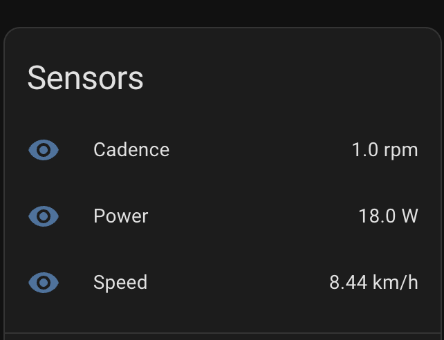

# Wahoo Kickr Core Home Assistant Integration (Custom)

WARNING: ⚠️ See #2. The integration is leading to excessive database growth. I recommend deactivating the extension or unplugging the device while not in use.

This repository contains a custom Home Assistant integration for a Wahoo KICKR CORE trainer using WFTNP over TCP.

## Important notes

- This integration is largely AI-generated.
- I do not take any responsibility for damage of any kind. Use at your own risk.
- Tested with Kickr Core V2 (Wifi only)
- Big thank you to @elfrances whose [work](https://github.com/elfrances/wahoo-fitness-tnp) served as the basis.

## What it does

- Discovers and connects to Wahoo WFTNP devices on the LAN (optionally via zeroconf).
- Exposes sensors for speed, cadence, and power.
- Provides services for ERG and grade control, plus basic control point actions.



## Devices (WiFi-capable)

At the time of this writing (late 2025) WFTNP is available on a wide range of indoor trainers from different manufacturers. The table below lists some of them:

| Brand | Model | WiFi |
| --- | --- | --- |
| Elite | Justo 2 | Y |
| Elite | Avanti | Y |
| JetBlack | Victory | Y |
| Tacx | Neo 3M | Y |
| Wahoo | KICKR V6 | Y |
| Wahoo | KICKR BIKE V2 | Y |
| Wahoo | KICKR MOVE | Y |
| Wahoo | KICKR BIKE SHIFT | Y |
| Wahoo | KICKR CORE V2 | Y |

## Installation (custom component)

1. Copy `custom_components/wftnp` into your Home Assistant config directory.
2. Restart Home Assistant.
3. Add the integration via Settings -> Devices & Services.

## Installation (HACS)

1. In Home Assistant, go to HACS -> Integrations.
2. Open the three‑dot menu and choose “Custom repositories”.
3. Add this repository URL and select category “Integration”:

```
https://github.com/kilianyp/hacs-wahoo-wftnp
```

4. Install “Wahoo Kickr Core” from HACS.
5. Restart Home Assistant.
6. Add the integration via Settings -> Devices & Services.

## Configuration

### Initial setup

When adding the integration, you can either pick an auto-discovered trainer or use manual setup.

- `device` (auto-discovery): Selects a discovered WFTNP trainer on your network.
- `host` (manual): Hostname or IP address of the trainer.
- `port` (manual): TCP port used by WFTNP. Default: `5555`.
- `name` (manual): Friendly device name shown in Home Assistant.
- `address` (manual): Optional address field used for metadata/display.

### Options

After setup, open the integration's options to tune update behavior:

- `sleep_timeout` (seconds, default `10`): If speed, cadence, and power stay at `0` for this duration, the trainer is treated as sleeping.
- `last_seen_interval` (seconds, default `60`): While sleeping, how often `last_seen` is refreshed.
- `update_throttle` (seconds, default `0`): Minimum time between active sensor publishes. `0` disables throttling.

Higher `update_throttle` values reduce state churn and database growth at the cost of less frequent updates.

The integration also exposes a diagnostic `Connection` switch in the device UI so you can manually disconnect/reconnect without changing options.

## Docker on macOS note

If you run Home Assistant in Docker on macOS, mDNS discovery may not work. Use manual setup and consider a host-side TCP forward (e.g., socat) to reach the trainer.

## Development

Ruff formatting is configured via `pyproject.toml`.

```bash
# Apply formatting
make format

# Validate formatting (CI-friendly)
make format-check

# Install Git pre-commit hooks
make precommit-install

# Run hooks manually across all tracked files
make precommit-run
```

The pre-commit hooks use your local `ruff` binary (`language: system`), so hook behavior and Ruff version stay aligned automatically.
